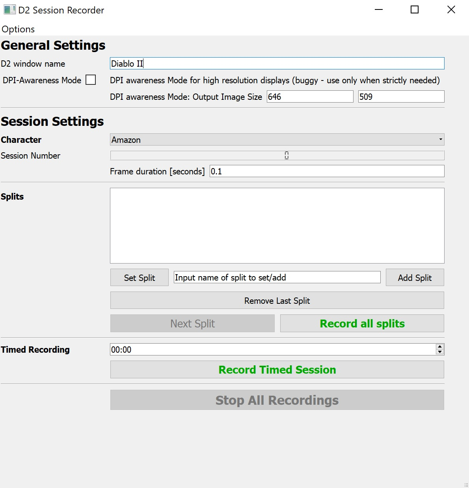

# D2companion
This project aims towards making a "smart Bot" that is able to play Diablo 2 without using scripted actions or manipulating the gamestate in an malicious manner.

## d2recorderui

A basic UI that allows you to start recording your gameplay in a format that may be used for training of the models.

## d2utilities

### d2utilities/d2io - Mouse/Keyboard/Screen I/O Utilities
A Mouse and Keyboard input is recorded to provide a corresponding label for each recorded frame.
The final model itself wil input via simulated mouse and keyboard actions.

#### d2screen
Connect to your running D2 application and includes the utilities to capture the screen at certain time intevals to get "frames" of the visible gamestate.
These images are used as features for the model training.

#### d2mouse/d2keyboard
These utilities listen to mouse and keyboard inputs and save them in a format that allows to connect them to the captured frames of the d2screen class.
These mouse/keyboard-input are used as labels in the Training-Data.

### d2utilities/d2recordsession

#### d2recordsession
The d2recordsession class contains the methods to manage your screen, mouse and keyboard and set the needed parameters and values for the gameplay recordings.

## Models

### GANcompressor Model
The idea is to not use the screenshot itself but a compressed version that should still include all the necessary information.
The compression of the images is done by using GANs. The setup is basically an Autoencoder with a latent layer:

Encoder --> Latent Layer --> Decoder

We will use the latent layer as the Input for our following Models. The decoder is to make sure the information in the latent layer is correlating with the original image.
